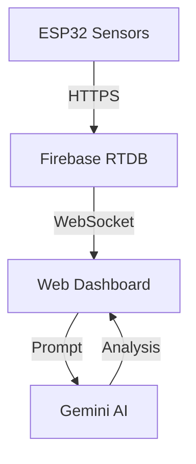

# Dashboard Backend Integration Guide (V2.1 BlueSentinel Edition)

## Overview

The BlueSentinel dashboard (V2.1) uses a hybrid approach:

1. **Firebase Realtime Database**: For live sensor data (5s updates).
2. **Google Gemini API**: For on-demand ecosystem analysis and remediation advice.
3. **Globe.gl & Chart.js**: For high-performance visualization.

---

## Architecture



---

## File Locations

| File | Purpose |
| :--- | :--- |
| `public/dashboard.html` | Semantically structured dashboard (Bento Grid) |
| `public/js/dashboard-enhanced.js` | **Main Logic**: Charts, Firebase listeners, & Gemini integration |
| `public/js/core/firebase-init.js` | Firebase configuration |
| `public/js/ai-chatbot.js` | SentinelBuddy AI Assistant logic |

---

## Backend Logic (`dashboard-enhanced.js`)

### 1. Real-Time Listeners

We subscribe to `BlueSentinel/sensors/latest` for instant updates.

```javascript
sensorLatestRef.on('value', handleLatestData);
```

- **Updates**: 4 Bento Cards (Temp, pH, Turbidity, DO)
- **Visuals**: Updates Sparkline charts (Chart.js) without full re-renders for performance.

### 2. AI Integration (Gemini)

When significant data changes occur or user requests analysis:

```javascript
async function refreshAnalysis(data) {
  // Constructs a prompt with current sensor values
  const prompt = `Analyze water quality: pH ${data.pH}, Temp ${data.temperature}...`;
  const analysis = await callGeminiAPI(prompt);
  updateUI(analysis);
}
```

### 3. CSV Export

- Built-in functionality to export the last 30 data points to CSV for researchers.

---

## Data flow & Schema

### ESP32 Payload

```json
{
  "temperature": 24.5,
  "pH": 7.8,
  "turbidity": 2.3,
  "dissolvedOxygen": 8.5,
  "timestamp": 1738454400000
}
```

### Database Rules

Rules are set to allow authenticated reads/writes.

```json
{
  "rules": {
    "BlueSentinel": {
      ".read": true,
      ".write": "auth != null"
    }
  }
}
```

---

## Debugging

### Simulation Mode

If Firebase is not connected or empty, the dashboard automatically enters **Simulation Mode**, generating realistic random data to demonstrate UI capabilities.

### Console Logs

Check for:

- `Firebase initialized`
- `Gemini API Key valid`
- `Incoming data: { ... }`

---

## Performance

- **Chart.js**: Animations disabled for real-time updates to reduce CPU load.
- **Glassmorphism**: CSS backdrop-filter used carefully to maintain >60fps.
