# System Architecture (V2.1)

## High-Level Overview

BlueSentinel V2.1 evolves from a simple IoT logger to a **Cyber-Physical System** incorporating AI and advanced visualization.

```mermaid
sequenceDiagram
    participant Sensor as ESP32 Sensor
    participant Cloud as Firebase RTDB
    participant Client as Web Dashboard
    participant AI as Gemini API

    Sensor->>Cloud: POST /BlueSentinel (JSON)
    Cloud->>Client: WebSocket Push (onChange)
    Client->>Client: Update Gauge/Chart
    
    rect rgb(20, 20, 30)
        Note right of Client: Anomaly Detected?
        Client->>AI: "Analyze this data"
        AI->>Client: "Remediation Advice"
        Client->>Client: Show Alert Modal
    end
```

---

## Component Layers

### 1. Sensing Layer (The "Nerves")

- **Hardware**: ESP32 + DS18B20/Analog Sensors.
- **Protocol**: HTTPS over WiFi.
- **Frequency**: 0.2Hz (Every 5s).

### 2. Data Layer (The "Memory")

- **Store**: Firebase Realtime Database.
- **Structure**:
  - Ephemeral: `sensors/latest` (Single Truth).
  - Persistent: `incidents/` (History).

### 3. Intelligence Layer (The "Brain")

- **Reactive**: Local JS logic for instant threshold checks (Latency <10ms).
- **Proactive**: Gemini AI for trend analysis and advice (Latency ~2s).

### 4. Presentation Layer (The "Face")

- **Framework**: Semantic HTML5 + Vanilla JS.
- **Design System**: BlueSentinel UI (Glassmorphism).
- **Visualization**:
  - `Globe.gl`: Spatial context.
  - `Bento Grid`: Information density.

---

## Security & Scalability

- **Stateless**: The dashboard is purely client-side; no heavy backend servers to manage.
- **CDN**: Assets served via Firebase Hosting global edge.
- **Auth**: API Keys restricted by domain (referer) and IP.
